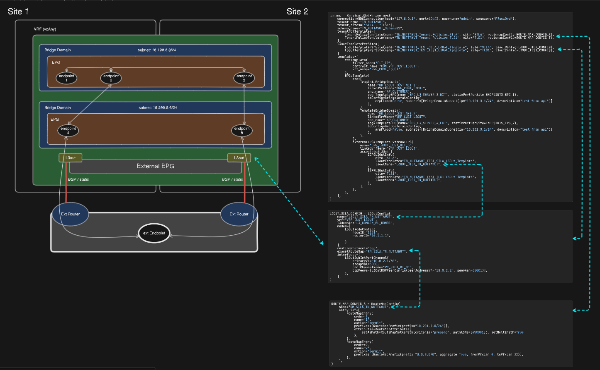

# Python library for manage Cisco NDO

Prerequisite: **python >= 3.10**

## Installation

Install with virtual environment is recommendaed

0. create your project directory

```bash
cd <path>
mkdir <your_dir_name>
cd <your_dir_name>
```

1. create venv under your project directory

```bash
python -m venv venv
```

2.  Copy NDOService directory to /venv/Lib/site-packages

```bash
# windows
copy <download_file_path>\NDOService .\venv\Lib\site-packages\

# linux/mac
cp <download_file_path>/NDOService ./venv/Lib/site-packages/
```

3. Copy python `requirement.txt` to your project directory

```bash
# windows
copy <download_file_path>\requirement.txt .

# linux/mac
cp <download_file_path>/requirement.txt .
```

4. Enable virtual env

```bash
# windows
. .\venv\Scripts\activate

# linux/mac
source ./venv/bin/activate
```

5. Install dependencies

```bash
pip install -f requirement.txt
```

note: `<download_file_path>` is path that you download library into

## Quick Start

```python
from NDOService.core.ndo_connector import NDOTemplate
from NDOService.core.configurations import *


params = {
    "connection": {"host": "127.0.0.1", "port": 10443, "username": "admin", "password": "P@ssw0rd"},
}

# INIT
ndo = NDOTemplate(
    params["connection"]["host"],
    params["connection"]["username"],
    params["connection"]["password"],
    params["connection"]["port"],
)
tenant = ndo.create_tenant("TEST_TENANT", ["SITE1","SITE2"])
# get schema by name if schema was not been created before, It will be created automatically
schema = ndo.create_schema("TEST_SCHEMA")
# create template to schema
ndo.create_template(schema, "TEST_TEMPLATE", tenant["id"])
# associate site to template
ndo.add_site_to_template(schema, "TEST_TEMPLATE", template_sites)
# PUT update to NDO
schema = ndo.save_schema(schema)
# create filter under template
ndo.create_filter_under_template(schema, "TEST_TEMPLATE", "TEST_FILTER")
# create contract under template
ndo.create_contract_under_template(schema, "TEST_TEMPLATE", "TEST_CON", "TEST_FILTER")
# add VRF object to template
ndo.create_vrf_under_template(schema, "TEST_TEMPLATE", "TEST_VRF", "TEST_CON")
```

## Example services

### L2 Service

_example_l2service.py_


### L3 Service

_example_l3service.py_


### L3OUT Service

_example_l3outservice.py_


## Util methods

#### create_tenant(\*\*kwargs):

Creates a new tenant with the given name, sites, and optional description.

```
Args:
    tenant_name (str): The name of the tenant.
    sites (list[str]): A list of site names associated with the tenant.
    tenant_desc (str, optional): The description of the tenant. Defaults to "".

Returns:
    Tenant: The created tenant object.

Raises:
    Exception: If the site does not exist in the network.
```

#### find_vpc_by_name(...):

Finds a VPC by its name within a specific site.

```
Args:
    vpc_name (str): The name of the VPC to find.
    site_name (str): The name of the site where the VPC is located.

Returns:
    VPCResourcePolicy | None: The VPC resource policy if found, None otherwise.

Raises:
    ValueError: If the specified site does not exist.
```

#### find_pc_by_name(...):

Finds a PC (Port Channel) by its name within a specific site.

```
Args:
    pc_name (str): The name of the PC to search for.
    site_name (str): The name of the site to search within.

Returns:
    PCResourcePolicy | None: The PC resource policy if found, otherwise None.

Raises:
    ValueError: If the specified site does not exist.
```

#### find_fabric_policy_by_name(...):

Finds a fabric policy by its name.

```
Args:
    name (str): The name of the fabric policy.

Returns:
    FabricPolicy | None: The fabric policy object if found, None otherwise.
```

#### find_fabric_resource_by_name(...):

Finds a fabric resource by its name.

```
Args:
    name (str): The name of the fabric resource.

Returns:
    FabricResourcePolicy | None: The fabric resource policy if found, None otherwise.
```

#### find_phyintf_setting_by_name(...):

Finds the physical interface setting by name.

```
Args:
    name (str): The name of the physical interface setting.

Returns:
    IntSettingPolicy | None: The physical interface setting if found, None otherwise.
```

#### find_pc_intf_setting_by_name(...):

Find the port channel interface setting by name.

```
Args:
    name (str): The name of the port channel interface setting.

Returns:
    IntSettingPolicy | None: The port channel interface setting if found, None otherwise.
```

#### find_domain_by_name(...):

Find a domain object by its name.

```
Args:
    domain_name (str): The name of the domain to find.
    site_name (str | None, optional): The name of the site. Defaults to None.
    site_id (str | None, optional): The ID of the site. Defaults to None.
    type (str, optional): The type of the domain, support value ["l3", ""]. Defaults to "".

Returns:
    dict | None: The domain dictionary if found, None otherwise.

Raises:
    ValueError: If neither site_name nor site_id is provided.
```

## Tenant Template methods

All of the methods in this Tenant Template will return the updated schema object. Note that it won't change the schema object in the NDO until you call the `save_schema` method with the updated schema object.

#### save_schema(\*\*kwargs):

Saves the given schema. This method is used to save the schema after making changes to it.

```
Args:
    schema (dict): The schema to be saved.

Returns:
    Schema: The saved schema.

Raises:
    Exception: If the request to save the schema fails.
```

#### create_schema(\*\*kwargs):

Creates a new schema with the given name and description.

```
Args:
    schema_name (str): The name of the schema.
    schema_desc (str, optional): The description of the schema. Defaults to "".

Returns:
    Schema: The created schema object.

Raises:
    Exception: If the schema creation fails.
```

#### create_template(\*\*kwargs):

Creates a template in the given schema.

```
Args:
  schema (dict): The schema to add the template to.
  template_name (str): The name of the template.
  tenant_id (str): The ID of the tenant.

Returns:
  Template: The created template object.
```

#### add_site_to_template(\*\*kwargs):

Adds a site to a template in the given schema.

```
Args:
    schema (dict): The schema containing the template and sites.
    template_name (str): The name of the template.
    sites (list[str]): The list of site names to be added.

Raises:
    Exception: If the site does not exist.

Returns:
    None: This method does not return anything.
```

#### create_filter_under_template(\*\*kwargs):

Creates a filter under a specified template.

```
Args:
    schema (dict): The schema containing the templates.
    template_name (str): The name of the template to create the filter under.
    filter_name (str): The name of the filter to be created.

Returns:
    Filter: The created filter object.

Raises:
    Exception: If the specified template does not exist.
```

#### create_contract_under_template(\*\*kwargs):

Creates a contract under a template.

```
Args:
    schema (dict): The schema containing templates and contracts.
    template_name (str): The name of the template.
    contract_name (str): The name of the contract to be created.
    filter_name (str): The name of the filter.
Returns:
    Contract: The created contract.
Raises:
    ValueError: If the specified template does not exist.
```

#### create_vrf_under_template(\*\*kwargs):

Create a VRF under a template.

```
Args:
    schema (dict): The schema containing the templates.
    template_name (str): The name of the template.
    vrf_name (str): The name of the VRF to be created.
    contract_name (str, optional): The name of the contract.
    vrf_config (VrfConfig | None, optional): The configuration for the VRF. Defaults to None.

Returns:
    Vrf: The created VRF.

Raises:
    ValueError: If the vrf_config is not an instance of VrfConfig.
    ValueError: If the template does not exist.
```

#### create_bridge_domain_under_template(\*\*kwargs):

Creates a bridge domain under a template.

```
Args:
    schema (dict): The schema containing the templates.
    template_name (str): The name of the template.
    linked_vrf_template (str): The name of the linked VRF template.
    linked_vrf_name (str): The name of the linked VRF.
    bd_name (str): The name of the bridge domain.
    bd_config (BridgeDomainConfig | None, optional): The configuration for the bridge domain. Defaults to None.

Returns:
    BD: The created bridge domain.

Raises:
    ValueError: If bd_config is not an instance of BridgeDomainConfig.
    ValueError: If the template does not exist.
```

#### create_anp_under_template(\*\*kwargs):

Creates a new Application Network Profile (ANP) under a specified template.

```
Args:
    schema (dict): The schema containing the templates.
    template_name (str): The name of the template to create the ANP under.
    anp_name (str): The name of the ANP to create.
    anp_desc (str, optional): The description of the ANP. Defaults to "".

Returns:
    ANP: The created ANP.

Raises:
    ValueError: If the specified template does not exist.
```

#### create_epg_under_template(\*\*kwargs):

Creates an EPG (Endpoint Group) under a given ANP (Application Network Profile).

```
Args:
    schema (dict): The schema containing the templates.
    anp_obj (dict): The ANP (Application Network Profile) object. This object should be obtained from `create_anp_under_template` method.
    epg_name (str): The name of the EPG (Endpoint Group) to be created.
    epg_config (EPGConfig): The configuration object for the EPG.

Returns:
    EPG: The created EPG (Endpoint Group) object.

Raises:
    ValueError: If epg_config is not an instance of EPGConfig.
```

#### create_ext_epg_under_template(\*\*kwargs):

Creates an External EPG under a given template.

```
Args:
    schema (dict): The schema containing the templates.
    template_name (str): The name of the template.
    epg_name (str): The name of the External EPG.
    vrf_name (str): The name of the VRF.
    vrf_template (str): The name of the VRF template.
    l3outToSiteInfo (List[EEPGL3OutInfo]): The list of L3Out to site information.
    epg_desc (str, optional): The description of the External EPG. Defaults to "".

Returns:
    ExtEPG: The created External EPG.

Raises:
    ValueError: If the template does not exist.
```

#### add_phy_domain_to_epg(\*\*kwargs):

Adds a physical domain to an EPG per site.

```
Args:
    schema (dict): The schema containing the templates.
    template_name (str): The name of the template.
    anp_name (str): The name of the ANP (Application Network Profile).
    epg_name (str): The name of the EPG (Endpoint Group).
    domain (str): The name of the physical domain to be added.
    site_name (str): The name of the target site.

Raises:
    ValueError: If the site does not exist, the template with the site does not exist, the ANP does not exist, or the EPG does not exist.

Returns:
    None: This method does not return anything.
```

#### add_static_port_to_epg(\*\*kwargs):

Adds a static port to the specified EPG.

```
Args:
    schema (dict): The schema containing the templates.
    template_name (str): The name of the template.
    anp_name (str): The name of the ANP (Application Network Profile).
    epg_name (str): The name of the EPG (Endpoint Group).
    site_name (str): The name of the site.
    port_configs (list[StaticPortPhy | StaticPortPC | StaticPortVPC]): A list of port configurations.
    strict_check (bool, optional): Whether to perform strict checking. Defaults to True.
    pod (str, optional): The name of the pod. Defaults to "pod-1".

Raises:
    ValueError: If the specified site or ANP does not exist.

Returns:
    None
```

#### delete_egp_under_template(\*\*kwargs):

Deletes an EPG under a specific template.

```
Args:
    schema (dict): The schema containing the templates.
    template_name (str): The name of the template.
    anp_name (str): The name of the ANP (Application Network Profile).
    epg_name (str): The name of the EPG (Endpoint Group).

Raises:
    ValueError: If the template or ANP does not exist.

Returns:
    None
```

#### delete_bridge_domain_under_template(\*\*kwargs):

Deletes a bridge domain under a given template.

```
Args:
    schema (dict): The schema containing the templates.
    template_name (str): The name of the template.
    bd_name (str): The name of the bridge domain to delete.

Raises:
    ValueError: If the template does not exist.

Returns:
    None
```

#### delete_vrf_under_template(\*\*kwargs):

Deletes a VRF under a specific template.

```
Args:
    schema (dict): The schema containing the templates.
    template_name (str): The name of the template.
    vrf_name (str): The name of the VRF to be deleted.

Raises:
    ValueError: If the template does not exist.

Returns:
    None
```

## L3Out Template Methods

#### create_l3out_template(...):

Creates an L3OutTemplate with the given parameters.

```
Args:
    template_name (str): The name of the L3OutTemplate.
    site_name (str): The name of the site.
    tenant_name (str): The name of the tenant.

Returns:
    L3OutTemplate: The created L3OutTemplate.

Raises:
    ValueError: If the site does not exist or the tenant does not exist.
    Exception: If there is an error during the creation of the L3OutTemplate.
```

#### add_l3out_under_template(...):

Adds an L3out to the specified template.

```
Args:
    template_name (str): The name of the template.
    l3outConfig (L3OutConfig): An object of class L3OutConfig representing the L3out configuration.

Raises:
    ValueError: If l3outConfig is not an object of class L3OutConfig or if the template does not exist.

Returns:
    None: This method does not return anything.
```

## Fabric Template Methods

#### create_fabric_policy(...):

Creates a fabric policy with the given name and site.

```
Args:
    name (str): The name of the fabric policy.
    site (str): The name of the site. where the fabric policy will be created.

Returns:
    FabricPolicy: The created fabric policy.

Raises:
    ValueError: If the site does not exist.
    Exception: If there is an error in the API response.
```

#### create_fabric_resource(...):

Creates a fabric resource policy with the given name and site.

```
Args:
    name (str): The name of the fabric resource policy.
    site (str): The name of the site where the fabric resource policy will be created.

Returns:
    FabricResourcePolicy: The created fabric resource policy.

Raises:
    ValueError: If the specified site does not exist.
    Exception: If there is an error during the creation of the fabric resource policy.
```

#### add_vlans_to_pool(...):

Adds a list of VLANs to a VLAN pool in a fabric policy.

```
Args:
    policy_name (str): The name of the fabric policy.
    pool_name (str): The name of the VLAN pool.
    vlans (list[int], optional): A list of VLAN IDs to be added to the pool. Defaults to an empty list.

Raises:
    ValueError: If the fabric policy does not exist.
    Exception: If there is an error in the API response.

Returns:
    None: This method does not return anything.
```

#### add_port_to_fabric_resource(...):

Adds a port to a fabric resource policy.

```
Args:
    resource_name (str): The name of the fabric resource policy.
    port_config (PhysicalIntfResource | PortChannelResource | VPCResource): The port configuration object.
    intf_policy_name (str): The name of the interface policy.

Raises:
    ValueError: If the fabric resource does not exist or the policy does not exist.
    Exception: If the port_config is not a valid object.

Returns:
    None: This method does not return anything.
```

#### add_domain_to_fabric_policy(...):

Adds a domain to a fabric policy.

```
Args:
    policy_name (str): The name of the fabric policy.
    domain_type (Literal["l3Domains", "domains"]): The type of the domain. Must be either "l3Domains" or "domains".
    domain_name (str): The name of the domain to be added.
    pool_name (str | None, optional): The name of the VLAN pool. Defaults to None.

Raises:
    ValueError: If the domain_type is not supported or if the policy does not exist.
    ValueError: If the VLAN pool does not exist in the policy.

Returns:
    None: This method does not return anything.
```

### Configuration Parameters

##### BridgeDomainConfig

- l2Stretch : if True it will create L2 stretch BD, if False subnets and intersiteBumTrafficAllow properties are ignored
- perSiteSubnet : List of tuple with site name and BridgeDomainSubnet object. Its only used when l2Stretch is False

```python
class BridgeDomainConfig:
    description: str = ""
    l2UnknownUnicast: Literal["proxy", "flood"] = "proxy"
    intersiteBumTrafficAllow: bool = True
    optimizeWanBandwidth: bool = True
    l2Stretch: bool = True
    l3MCast: bool = False
    unkMcastAct: Literal["opt-flood", "flood"] = "flood"
    v6unkMcastAct: Literal["opt-flood", "flood"] = "flood"
    arpFlood: bool = True
    multiDstPktAct: Literal["bd-flood", "encap-flood", "drop"] = "bd-flood"
    unicastRouting: bool = True
    subnets: List[BridgeDomainSubnet] = field(default_factory=list)
    perSiteSubnet: List[tuple[str, BridgeDomainSubnet]] = field(default_factory=list)
```

##### VrfConfig

```python
class VrfConfig:
    description: str = ""
    l3MCast: bool = False
    preferredGroup: bool = False
    vzAnyEnabled: bool = True
    ipDataPlaneLearning: Literal["enabled", "disabled"] = "enabled"
```

##### EPGConfig

- linked_template : name of the template that BridgeDomain is linked to
- linked_bd : name of the BridgeDomain that EPG is linked to

```python
class EPGConfig:
    epg_desc: str = ""
    linked_template: str
    linked_bd: str
    proxyArp: bool = False
    mCastSource: bool = False
    preferredGroup: bool = False
    intraEpg: Literal["unenforced", "enforced"] = "unenforced"
```

##### L3OutConfig

- name : the name of L3OUT template
- vrf : the VRF name for this L3OUT
- l3domain : name of L3 domain
- nodes : List of L3OutNodeConfig object
- routingProtocol : either bgp or ospf
- exportRouteMap : name of route map in Tenant policy
- interfaces : List of L3OutInterfaceConfig object
- pimEnabled : PIM setting default is disabled
- interfaceRoutingPolicy : name of L3Out Interface Routing Policy in Tenant policy

```python
class L3OutConfig:
    name: str
    vrf: str
    l3domain: str
    nodes: List[L3OutNodeConfig]
    routingProtocol: Literal["bgp"] | None = None
    interfaces: List[L3OutInterfaceConfig | L3OutSubInterfaceConfig | L3OutSviInterfaceConfig]
    exportRouteMap: str | None = None
    importRouteMap: str | None = None
    importRouteControl: bool = False
    pimEnabled: bool = False
    interfaceRoutingPolicy: str | None = None
```

##### L3OutNodeConfig

- nodeID : node id example "1101"
- routerID : IP address format (ww.xx.yy.zz)

```python
class L3OutNodeConfig:
    nodeID: str
    routerID: str
    podID: str = "1"
    useRouteIDAsLoopback: bool = False
    staticRoutes: List[L3OutStaticRouteConfig] = field(default_factory=list)
```

##### L3OutStaticRouteConfig

- prefix : IP address with prefix format `(ww.xx.yy.zz/aa)`
- fallbackPref : is `Administrative Distance` incase the AD in each nexthop is unspecified it will fallback to use this AD. Default is 1
- nullNextHop : if it true `it will create a static route to Null0`

---

- nextHopIP : IP address format (ww.xx.yy.zz)
- preference : is `Administrative Distance`

```python
class L3OutStaticRouteConfig:
    prefix: str
    fallbackPref: int = 1
    enableBFDTracking: bool = False
    nullNextHop: bool = False
    nextHops: List[L3OutStaticRouteNextHop]

class L3OutStaticRouteNextHop:
    nextHopIP: str
    preference: int = 0
```
